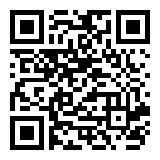

Look closely at your phone and choose the appropriate section. These instructions will load
the live schedule that works offline to your phone, so you can bookmark interesting sections
beforehand and get notifications.

# Android Device

On an Android phone, install the [Giggity app](https://play.google.com/store/apps/details?id=net.gaast.giggity)
(scan the first code), start it and click on a "+" button, then click "Scan QR" and scan the second code.
Or copy the [XML link](schedule/baltic20.xml) if you're reading this on a phone.

    

         
        <a href="https://play.google.com/store/apps/details?id=net.gaast.giggity">Get Giggity on Google Play Store</a>
    

    

         
        <a href="schedule/baltic20.xml">XML schedule for Giggity</a>
    

# iPhone or iPad

On an iOS device, simply start a camera and scan the code below. It will add
all conference events to your calendar. Or click on an [iCalendar](schedule/baltic20.ics)
link. You can easily disable and delete the section afterwards.

     
    <a href="schedule/baltic20.ics">iCalendar schedule</a>

